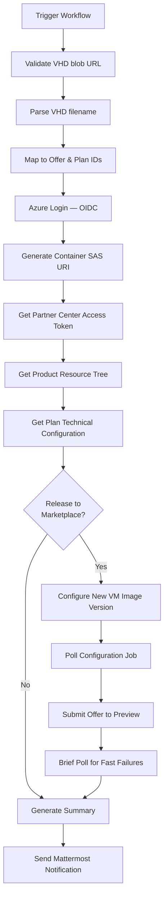

# Azure Marketplace Publishing

## Overview

This repository includes a GitHub Actions workflow for publishing AlmaLinux OS images to Azure Marketplace using the Microsoft Partner Center [Product Ingestion API](https://learn.microsoft.com/en-us/partner-center/marketplace-offers/product-ingestion-api).

## Files

### `.github/workflows/azure-to-marketplace.yml`

Workflow for releasing AlmaLinux OS VHD images to Azure Marketplace as new VM image versions.

**What it does:**
- Accepts a VHD blob URL from Azure Blob Storage (same blobs used by `azure-to-gallery.yml`)
- Parses the VHD filename to extract version, timestamp, architecture, and image type (including HPC)
- Maps the image to the corresponding Azure Marketplace offer and plan (including `almalinux-hpc` for HPC images)
- Generates a container-level SAS URI with Read + List permissions
- Authenticates to the Partner Center Product Ingestion API via Azure AD token
- Fetches the product resource tree and current plan technical configuration
- Adds a new VM image version to the plan, preserving all existing versions and properties
- Submits the offer to **Preview** for Microsoft certification
- Sends Mattermost notifications and generates a GitHub Actions job summary with Partner Center links

**Usage:**
```
Trigger via GitHub UI: Actions → Azure image to Marketplace release

Inputs:
  - image_blob_url:          VHD blob URL in Azure Storage (required)
  - release_to_marketplace:  true/false (default: false)
  - notify_mattermost:       true/false (default: true)
```

## Required GitHub Configuration

### Secrets
| Secret | Description |
|--------|-------------|
| `AZURE_CLIENT_ID` | Azure service principal client ID |
| `AZURE_TENANT_ID` | Azure tenant ID |
| `AZURE_SUBSCRIPTION_ID` | Azure subscription ID |
| `MATTERMOST_WEBHOOK_URL` | Mattermost incoming webhook URL |

### Variables (`vars.*`)
| Variable | Description |
|----------|-------------|
| `MATTERMOST_CHANNEL` | Mattermost channel for notifications |

### GitHub Permissions
The workflow requires:
- `id-token: write` — for Azure OIDC authentication
- `contents: read` — for repository checkout

## Prerequisites

1. **Azure Service Principal**
   - Must be configured for OIDC (federated credentials) authentication with GitHub Actions
   - Requires permissions to:
     - Read storage account keys (`Microsoft.Storage/storageAccounts/listKeys/action`)
     - Generate container SAS tokens
   - **Must be registered in [Partner Center](https://partner.microsoft.com/) with the Manager role:**
     Partner Center → ⚙️ Account settings → User management → Add Azure AD application

2. **Azure Storage Account**
   - Default storage account: `almalinux`
   - Contains per-version/type storage containers (same as `azure-to-gallery.yml`)
   - VHD blobs must already be uploaded (typically by `azure-to-gallery.yml`, `azure_uploader.sh`, or `azure-hpc-to-storage-container.yml` for HPC images)

3. **Partner Center Offers**
   - "Core virtual machine" offers must exist in Partner Center
   - Each offer must have plans with existing technical configurations (image types, SKUs, etc.)
   - At least one published VM image version must exist per plan

4. **Azure AD Token Resource**
   - The Partner Center Product Ingestion API uses `https://graph.microsoft.com` as the token audience
   - The service principal must have access to this resource

## Supported Offers and Plans

The workflow maps AlmaLinux versions and image types to Partner Center offer/plan IDs:

| Version | Image Type | Offer ID | Plan ID |
|---------|------------|----------|---------|
| AlmaLinux 8 | x86_64 | `almalinux-x86_64` | `8-gen2` |
| AlmaLinux 8 | arm64 | `almalinux-arm` | `8-arm-gen2` |
| AlmaLinux 8 | hpc | `almalinux-hpc` | `8-hpc-gen2` |
| AlmaLinux 9 | x86_64 | `almalinux-x86_64` | `9-gen2` |
| AlmaLinux 9 | arm64 | `almalinux-arm` | `9-arm-gen2` |
| AlmaLinux 9 | arm64-64k | `almalinux-arm` | `9-arm-64k-gen2` |
| AlmaLinux 9 | hpc | `almalinux-hpc` | `9-hpc-gen2` |
| AlmaLinux 10 | x86_64 | `almalinux-x86_64` | `10-gen2` |
| AlmaLinux 10 | arm64 | `almalinux-arm` | `10-arm64-gen2` |
| AlmaLinux 10 | arm64-64k | `almalinux-arm` | `10-arm64-64k-gen2` |
| Kitten 10 | x86_64 | `kitten` | `10-x64-gen2` |
| Kitten 10 | arm64 | `kitten` | `10-arm64-gen2` |

## VHD Filename Patterns

The workflow parses VHD filenames to extract metadata. Two formats are supported:

### Modern Format
```
AlmaLinux-{major}-Azure-{version}-{date}.{index}.{arch}.vhd
AlmaLinux-Kitten-Azure-{major}-{date}.{index}.{arch}.vhd
```
Examples:
- `AlmaLinux-10-Azure-10.1-20260216.0.x86_64.vhd`
- `AlmaLinux-Kitten-Azure-10-20260306.0.x86_64.vhd`
- `AlmaLinux-9-Azure-9.7-20250522.0-64k.aarch64.vhd`

### HPC Format
```
AlmaLinux-{major}-HPC-{version}-{date}.{index}.{arch}.vhd
```
Examples:
- `AlmaLinux-8-HPC-8.10-20260330.0.x86_64.vhd`
- `AlmaLinux-9-HPC-9.7-20260330.0.x86_64.vhd`

### Legacy Format
```
almalinux-{version}-{arch}.{date}-{index}.vhd
```
Example: `almalinux-8.10-x86_64.20250905-01.vhd`

### Extracted Metadata
- `RELEASE_VERSION` — distribution version (e.g., `9.7`, `10.1`, `10`)
- `MAJOR_VERSION` — major version number (e.g., `8`, `9`, `10`)
- `TIMESTAMP` — date with optional index (e.g., `20250905-01`, `20260306.0`)
- `ARCH` — architecture (`x86_64`, `aarch64`, or `arm64`)
- `IMAGE_TYPE` — `default`, `arm64`, `arm64-64k`, or `hpc`

## Package Version Format

The VM image version number must be in three-part `X.Y.Z` format:

| Type | Formula | Example |
|------|---------|---------|
| AlmaLinux 8.x | `{major}.{minor}.{date}{index}` | `8.10.2025090501` |
| AlmaLinux 9.x | `{major}.{minor}.{date}{index}` | `9.7.2025121501` |
| AlmaLinux 10.x | `{major}.{minor}.{date}{index}` | `10.1.202512150` |
| Kitten 10 | `{major}.{date}.{index}` | `10.20260306.0` |

## Workflow Process



### SAS URI Generation

The SAS URI is generated at the **container** level (not directly on the blob):

1. Retrieve the storage account key via `az storage account keys list`
2. Generate a container SAS token with `Read` + `List` permissions and a configurable expiry
3. Construct the VHD SAS URI by inserting the blob filename into the container SAS URL

```
Container SAS: https://<account>.blob.core.windows.net/<container>?<sas_token>
VHD SAS URI:   https://<account>.blob.core.windows.net/<container>/<blob>.vhd?<sas_token>
```

> **Note:** User delegation SAS (`--as-user`) is limited to 7-day expiry. The workflow uses account-key auth to allow longer expiry windows.

### Partner Center API Authentication

The workflow obtains an Azure AD token scoped to `https://graph.microsoft.com` using:
```
az account get-access-token --resource https://graph.microsoft.com
```

This token is used for all Product Ingestion API calls (`https://graph.microsoft.com/rp/product-ingestion/...`).

### Product Resource Tree

The resource tree provides the complete offer structure:
- Product metadata
- Plans and their durable IDs
- Technical configurations (SKUs, image types, VM properties, existing versions)
- Submission resources
- Pricing and availability

The workflow uses the tree to:
1. Resolve plan `externalId` → durable ID
2. Extract the current technical configuration for the target plan
3. Discover existing VM image types (`x64Gen1`, `x64Gen2`, `armGen2`)

### Configure New VM Image Version

The configuration payload:

1. **Starts from the full existing technical configuration** — preserving all properties (`operatingSystem`, `softwareType`, `skus`, `vmProperties`, etc.)
2. **Removes the internal `id` field** (API expects `externalId` references)
3. **Overrides `product` and `plan`** with `externalId` format
4. **Merges VM image versions** — all existing published versions are preserved (removing them would be interpreted as deletion); a new version is appended (or replaces a draft with the same `versionNumber`)
5. **Forces "sticky" `vmProperties` booleans to `true`** — once properties like `supportsNVMe`, `supportsCloudInit`, `supportsSriov`, and `supportsBackup` are enabled on a plan, they cannot be disabled; the resource tree may reflect a stale draft, so these are explicitly set

The outer `$schema` is `https://schema.mp.microsoft.com/schema/configure/2022-03-01-preview2`, and the inner resource uses `https://schema.mp.microsoft.com/schema/core-virtual-machine-plan-technical-configuration/2022-03-01-preview6`.

### Submit to Preview

After the configuration draft is created, the workflow submits the offer to **Preview** (Microsoft's certification pipeline):

```json
{
  "$schema": "https://schema.mp.microsoft.com/schema/configure/2022-03-01-preview2",
  "resources": [{
    "$schema": "https://schema.mp.microsoft.com/schema/submission/2022-03-01-preview2",
    "product": { "externalId": "<offer_id>" },
    "target": { "targetType": "preview" }
  }]
}
```

The certification process typically takes **30 minutes to several hours**. The workflow polls briefly (2 minutes) to catch fast failures, then exits successfully.

> **Important:** Publishing flow is `draft → preview → live`. The workflow automates `draft` and `preview`. Once Azure approves the preview, you must **publish to Live manually** from Partner Center.

## Manual Steps After Workflow Completes

1. **Check the offer history** in [Partner Center](https://partner.microsoft.com/dashboard/marketplace-offers/overview) — the workflow includes a direct link in the job summary and Mattermost notification
2. **Wait for Microsoft to approve** the preview (certification typically takes 30 min – several hours)
3. **Publish to Live** manually from Partner Center once the preview is approved

## Testing

1. **Dry Run** (recommended for first test)
   - Set `release_to_marketplace: false`
   - Performs: input validation → filename parsing → offer/plan mapping → SAS generation → resource tree fetch → tech config extraction
   - Does NOT configure any VM image version or submit anything
   - Verify the parsed metadata, offer/plan mapping, and SAS URI in the job summary

2. **Full Run**
   - Set `release_to_marketplace: true`
   - Performs the complete flow: configure draft + submit to preview
   - Monitor the configuration job status in the workflow output
   - Check the offer history in Partner Center after completion

## Troubleshooting

### Common Issues

1. **"Invalid Azure blob URL" validation error**
   - The URL must match `https://<account>.blob.core.windows.net/<container>/<blob>.vhd`
   - Ensure the URL is a direct Azure Blob Storage URL (not a SAS URL)

2. **"Could not parse filename" error**
   - Ensure the VHD filename follows one of the supported patterns (modern or legacy)
   - Check for unexpected characters or missing version/date components

3. **"Unsupported: version=…, image_type=…" error**
   - The version/image type combination doesn't match any known offer/plan mapping
   - Check the [Supported Offers and Plans](#supported-offers-and-plans) table

4. **Azure login fails (AADSTS700213)**
   - The OIDC token subject doesn't match the federated identity credential in Azure AD
   - Azure AD federated credentials require **exact match** on the subject (no wildcards)
   - Add the specific branch/environment as a federated credential, or run from `main`

5. **SAS generation fails with "expiry should be within 7 days"**
   - This happens when using `--as-user` (user delegation SAS). The workflow uses account-key auth which allows longer expiry
   - Ensure the service principal has permission to list storage account keys

6. **"Failed to get product data" (HTTP 403)**
   - The Azure AD app is not registered in Partner Center with the **Manager** role
   - Go to Partner Center → ⚙️ Account settings → User management → Add Azure AD application

7. **"Access token validation failure. Invalid audience" (HTTP 401)**
   - The token was acquired for the wrong resource
   - The Partner Center Product Ingestion API requires `https://graph.microsoft.com` as the audience

8. **"Technical configuration not found for plan"**
   - The plan `externalId` doesn't match any plan in the resource tree
   - Check the debug output for available plans and their `externalId` values

9. **"SupportsNVMe property has already been enabled" error**
   - Once `vmProperties` booleans are enabled, they cannot be disabled
   - The workflow forces `supportsNVMe`, `supportsCloudInit`, `supportsSriov`, and `supportsBackup` to `true`
   - If the resource tree shows `false` for a property that's actually `true` in the live state, the workflow's forced `true` values prevent this error

10. **"Cannot delete image '…' as it is already published" error**
    - The API interprets missing published versions as deletion requests
    - The workflow merges all existing versions with the new one to prevent this
    - If the error persists, check that the tech config from the resource tree includes all published versions

11. **"Expected a submission id that isn't null or 0 since target type is Live"**
    - You cannot submit directly to "live" — submit to "preview" first
    - The workflow targets `"preview"` by default

12. **Configuration job completes with `failed` result**
    - Check the `errors[]` array in the job response for specific messages
    - Common causes: schema validation, missing required fields, conflicting properties
    - The full job response is printed in the workflow output

13. **Submission takes longer than expected**
    - Microsoft's certification pipeline can take 30 min – several hours
    - The workflow exits after a 2-minute fast-fail check
    - Track progress via the offer history link in the job summary

## Support

- Azure Partner Center: https://partner.microsoft.com/dashboard/marketplace-offers/overview
- Product Ingestion API docs: https://learn.microsoft.com/en-us/partner-center/marketplace-offers/product-ingestion-api
- AlmaLinux Cloud SIG Chat: https://chat.almalinux.org/almalinux/channels/sigcloud
- Workflow run logs: GitHub Actions tab in the repository
