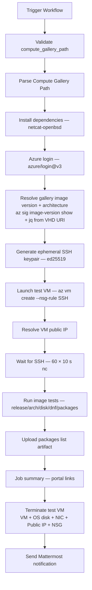

# Azure Compute Gallery Image Testing

## Overview

This repository includes a GitHub Actions workflow for post-publish sanity-testing AlmaLinux OS image versions in an Azure Compute Gallery. The workflow launches a fresh VM from a given gallery image version, runs a small set of release / arch / disk / `dnf` assertions over SSH, collects the installed-package list, tears the VM and its auto-created peers down on `always()`, and posts a Mattermost summary.

It is the Azure counterpart of [`OCI_TEST.md`](OCI_TEST.md).

## Files

### `.github/workflows/azure-test.yml`

Workflow for validating a Compute Gallery image version end-to-end.

**What it does:**
- Accepts a `compute_gallery_path` of the form `gallery_name/vm_image_definition/vm_image_version` (e.g. `almalinux/almalinux-9-gen2/9.7.2026050101`)
- Resolves the gallery image-version resource ID and source VHD URI via `az sig image-version show`
- Reverse-engineers the architecture from the source VHD filename using the same regex pair as [`AZURE_GALLERY.md`](AZURE_GALLERY.md) (so any image definition that release publishes is automatically supported)
- Generates an ephemeral ed25519 SSH keypair, creates a test VM with `az vm create --nsg-rule SSH`, waits for SSH, runs the assertions, then deletes the VM, OS disk, NIC, public IP, and NSG by their auto-generated names
- Uploads the package list as a workflow artifact
- Sends a Mattermost notification with portal links to the gallery image and the (now-deleted) test VM

**Usage:**
```
Trigger via GitHub UI: Actions → Azure: Test Image

Inputs:
  - compute_gallery_path: gallery_name/vm_image_definition/vm_image_version
                          (e.g. almalinux/almalinux-9-gen2/9.7.2026050101)
  - notify_mattermost:    Send notification to Mattermost (default: true)
```

The release workflow [`azure-to-gallery.yml`](AZURE_GALLERY.md) emits a structured `- Created: '<gallery>/<def>/<ver>'` line for every uploaded image-version, so the Mattermost release notification ends with a copy-pasteable `compute_gallery_path` for this workflow.

## Required GitHub Configuration

### Secrets
| Secret | Description |
|--------|-------------|
| `AZURE_CLIENT_ID` | Azure service principal client ID |
| `AZURE_TENANT_ID` | Azure tenant ID |
| `AZURE_SUBSCRIPTION_ID` | Azure subscription ID |
| `MATTERMOST_WEBHOOK_URL` | Mattermost incoming webhook URL |

### Variables (`vars.*`)
| Variable | Description |
|----------|-------------|
| `MATTERMOST_CHANNEL` | Mattermost channel for notifications |

### GitHub Permissions
The workflow requires:
- `id-token: write` — for Azure OIDC authentication via `azure/login@v3`
- `contents: read` — for repository checkout

### Workflow-level `env`
Resource group and region are pinned at the workflow level (matching the convention in `tools/azure_uploader.sh`):
| Env | Value |
|-----|-------|
| `RESOURCE_GROUP` | `rg-alma-images` (holds both the gallery and the test VM) |
| `AZURE_LOCATION` | `East US` |
| `AZURE_PORTAL_BASE_URL` | `https://portal.azure.com/#@/resource` |
| `SSH_USER` (job-level) | `almalinux` |

## Required Azure RBAC

The OIDC service principal behind `AZURE_CLIENT_ID` needs the following actions, assigned at the `rg-alma-images` resource-group scope:

```
Microsoft.Compute/galleries/images/read
Microsoft.Compute/virtualMachines/write
Microsoft.Compute/virtualMachines/delete
Microsoft.Compute/virtualMachines/deletePreservedOSDisk/action
Microsoft.Compute/disks/delete
Microsoft.Network/networkInterfaces/write
Microsoft.Network/networkInterfaces/join/action
Microsoft.Network/networkInterfaces/delete
Microsoft.Network/networkSecurityGroups/read
Microsoft.Network/networkSecurityGroups/write
Microsoft.Network/networkSecurityGroups/join/action
Microsoft.Network/networkSecurityGroups/delete
Microsoft.Network/publicIPAddresses/read
Microsoft.Network/publicIPAddresses/write
Microsoft.Network/publicIPAddresses/join/action
Microsoft.Network/publicIPAddresses/delete
Microsoft.Network/virtualNetworks/write
Microsoft.Network/virtualNetworks/subnets/join/action
Microsoft.Resources/deployments/read
Microsoft.Resources/deployments/write
Microsoft.Resources/deployments/operationStatuses/read
```

The same list is duplicated as a comment in the workflow header so a future maintainer composing a least-privilege custom role doesn't have to rediscover it by trial-and-error dispatches.

## Compute Gallery Path Parsing

The single workflow input is split on `/` into three components, then the version is split on `.` into Major/Minor/Patch shape:

| Shape | Example | `ALMA_VERSION` | `DATESTAMP_ITERATION` | `RELEASE_STRING` |
|-------|---------|----------------|----------------------|-----------------|
| Stable AlmaLinux | `almalinux/almalinux-9-gen2/9.7.2026050101` | `9.7` | `2026050101` | `AlmaLinux release 9.7` |
| Stable AlmaLinux 10 | `almalinux_ci/almalinux-ci-10-arm64-gen2/10.1.202605020` | `10.1` | `202605020` | `AlmaLinux release 10.1` |
| Kitten 10 | `almalinux_ci/almalinux-ci-kitten-10-x64-gen2/10.20260501.0` | `10` | `20260501.0` | `AlmaLinux Kitten release 10` |

A `*kitten*` branch in the parse step handles the Kitten `Major.Datestamp.Iteration` shape (no minor); stable AlmaLinux uses `Major.Minor.Patch`.

`CUSTOM_IMAGE_NAME` (used as the artifact name and notification label) is derived from the source VHD filename without the `.vhd` extension — so it matches the artifact name produced by `azure-to-gallery.yml`.

## Architecture Detection

Architecture is **not** mapped from the gallery name; it is reverse-engineered from the source VHD filename returned by `az sig image-version show`. The workflow tries both regexes the release path uses:

```bash
regex_azure='-([0-9]+\.?[0-9]*)-([0-9]{8,9}(\.[0-9])?).*\.(x86_64|aarch64|arm64)'
regex_simple='almalinux-([0-9]+\.[0-9]+)-(x86_64|aarch64|arm64)\.([0-9]{8})'
```

`arm64` returned by the regex is normalised to `aarch64` so the in-VM `rpm -q ... | grep <arch>` test keeps working. Architecture then maps to a default Azure VM size:

| Architecture | VM size |
|---|---|
| `x86_64` | `Standard_D2as_v5` |
| `aarch64` | `Standard_D2ps_v5` |

The same defaults are used for Gen1 and 64K-page-size variants until a need to differentiate them surfaces.

## Test Assertions

Once SSH is reachable on the VM, the following checks run in sequence (failure of any aborts the workflow):

1. **AlmaLinux release** — `grep '<RELEASE_STRING>' /etc/almalinux-release`
2. **Release package** — `rpm -qf /etc/almalinux-release` (resolved on the VM, so it works for both stable and Kitten release packages)
3. **System architecture** — `rpm -q --qf='%{ARCH}\n' <RELEASE_PACKAGE> | grep '<ALMA_ARCH>'`
4. **Disk and filesystems** — `lsblk` listing
5. **Root filesystem resize** — root must be ≥ 98 GiB (the OS-disk-size-gb passed to `az vm create` is 100 GiB)
6. **Updates available** — `sudo dnf check-update` (exit code `100` is treated as success — it just means updates are pending)
7. **Installed-package list** — `rpm -qa --queryformat '%{NAME}\n' | sort > /tmp/<CUSTOM_IMAGE_NAME>.txt`, then SCP'd back and uploaded as a workflow artifact

## Workflow Process



## VM Lifecycle

The VM is named `azure-test-${ALMA_VERSION}-${DATESTAMP_ITERATION}-${ALMA_ARCH}-${GITHUB_RUN_ID}` (Azure VM names allow dots, so the version dot is preserved as-is for grep-ability in audit logs). `--nsg-rule SSH` opens port 22 from anywhere for the lifetime of the VM, which is acceptable because the VM is short-lived and the SSH key is ephemeral.

The `Terminate test VM` step runs under `if: always() && env.VM_NAME != ''` and deletes — each call wrapped in `|| true` so cleanup always advances:

| Resource | Auto-generated name | `az` command |
|----------|--------------------|--------------|
| VM | `${VM_NAME}` | `az vm delete --yes --force-deletion true` |
| OS disk | resolved from `az vm show storageProfile.osDisk.name` | `az disk delete --yes --no-wait` |
| NIC | `${VM_NAME}VMNic` | `az network nic delete --no-wait` |
| Public IP | `${VM_NAME}PublicIP` | `az network public-ip delete --no-wait` |
| NSG | `${VM_NAME}NSG` | `az network nsg delete --no-wait` |

The `set -e` step still runs all six `az` calls regardless of any one failing.

## Testing

1. **First test against an aarch64 release** (private CI gallery):
   ```
   compute_gallery_path = almalinux_ci/almalinux-ci-10-arm64-gen2/10.1.202605020
   ```
2. **First test against an x86_64 stable release** (public gallery):
   ```
   compute_gallery_path = almalinux/almalinux-9-gen2/9.7.2026050101
   ```
3. **Kitten release**:
   ```
   compute_gallery_path = almalinux_ci/almalinux-ci-kitten-10-x64-gen2/10.20260501.0
   ```

After each run, verify cleanup with:
```bash
az resource list -g rg-alma-images --query "[?contains(name, '<run_id>')]"
# Expected: []
```

## Troubleshooting

### Common Issues

1. **"Invalid Compute Gallery Path" validation error**
   - The regex requires three slash-separated parts and a three-part dot version. Kitten paths (`gallery/def/Major.Datestamp.Iteration`) and stable paths (`gallery/def/Major.Minor.Patch`) are both accepted.

2. **"Gallery image version not found"**
   - The `az sig image-version show` call returned a non-zero exit. Confirm the path with `az sig image-version list -g rg-alma-images -r <gallery> -i <def>`.

3. **"Could not extract image-version metadata"**
   - The `az` call succeeded but `jq` could not find `id` or the source VHD URI under either `.storageProfile.osDiskImage.source.uri` or `.properties.storageProfile.osDiskImage.source.uri`. The raw JSON is dumped to the run log for inspection.

4. **"Could not parse architecture from VHD source"**
   - The source VHD filename did not match either `regex_azure` or `regex_simple`. Inspect the VHD URI in the run log; the parsing rule lives in [`AZURE_GALLERY.md`](AZURE_GALLERY.md) and may need to be extended for the new shape on the release path first.

5. **"AuthorizationFailed" on `Microsoft.Compute/galleries/images/read`**
   - The service principal lacks the read permission on the gallery. Grant the 21 RBAC actions listed above at `rg-alma-images` scope (or attach a custom role with the same set).

6. **"SSH did not become reachable within 10 minutes"**
   - The VM came up but SSH never opened on port 22 from the runner. Possible causes: NSG rule didn't apply (rare), cloud-init not finished, SSH user wrong (the workflow assumes `almalinux` — older AlmaLinux Azure images sometimes only accept `azureuser`).

7. **"Root filesystem resize check failed"**
   - The root filesystem on the test VM did not auto-grow to ≥ 98 GiB. Indicates a `cloud-init` / `growpart` regression in the published image.

8. **`dnf check-update` exits with non-100, non-0 code**
   - Repo metadata fetch failure or signed metadata mismatch. Re-run; if persistent, check that `RELEASE_VERSION` repo data matches the image's release.

### Linter Warnings

GitHub Actions YAML linters may show "Context access might be invalid" warnings for environment variables set via `$GITHUB_ENV`. These are false positives — the workflow functions correctly.

## Support

- Azure Portal: https://portal.azure.com
- Azure Compute Gallery docs: https://learn.microsoft.com/en-us/azure/virtual-machines/azure-compute-gallery
- AlmaLinux Cloud SIG Chat: https://chat.almalinux.org/almalinux/channels/sigcloud
- Workflow run logs: GitHub Actions tab in the repository
