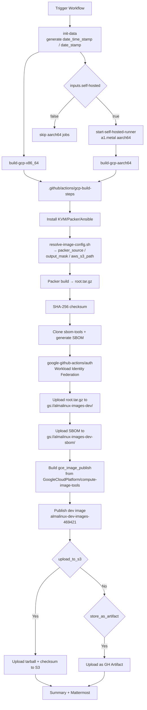

# Build GCP Images

## Overview

This document covers `.github/workflows/gcp-build.yml` (display name **`GCP: Build Image`**) and its dedicated composite action `.github/actions/gcp-build-steps/action.yml`.

GCP builds are separated from the rest of the cloud-image pipelines because each build also:

- generates a Software Bill of Materials (SBOM) using the [`AlmaLinux/cloud-images-sbom-tools`](https://github.com/AlmaLinux/cloud-images-sbom-tools) repo,
- authenticates to GCP via Workload Identity Federation (no static keys),
- uploads `root.tar.gz` and the SBOM to the **dev** GCS buckets, and
- publishes a test image into the `almalinux-dev-images-469421` project via the upstream `gce_image_publish` tool.

The build workflow is the first stage of the end-to-end GCP pipeline. Testing (CIT) and production publishing are separate workflows documented in [GCP_IMAGE_TEST_PUBLISH.md](GCP_IMAGE_TEST_PUBLISH.md).

For other cloud images see [BUILD_IMAGES.md](BUILD_IMAGES.md); for Vagrant boxes see [BUILD_VAGRANT.md](BUILD_VAGRANT.md).

## Workflow inputs

| Input | Type | Default | Notes |
| :--- | :--- | :--- | :--- |
| `date_time_stamp` | string | auto (`date -u +%Y%m%d%H%M%S`) | Shared timestamp for both matrix legs. |
| `version_major` | choice | `10` | `10-kitten`, `10`, `9`, `8`. |
| `self-hosted` | boolean | `true` | If `false`, skip the aarch64 jobs. |
| `store_as_artifact` | boolean | `false` | Upload the image tarball as a GitHub Actions artifact. |
| `upload_to_s3` | boolean | `true` | Also upload the image + checksum to the configured S3 bucket (in addition to GCS). |
| `notify_mattermost` | boolean | `false` | Post a build summary to Mattermost. |

Triggered manually from the GitHub UI: *Actions → GCP: Build Image → Run workflow*.

Note: `gcp-build.yml` has no `run_test` or `vagrant_type` input — GCP images are tested later by the dedicated `gcp-test.yml` workflow, not in the build job itself.

## Outputs

Every build produces:

- **Image tarball** — `.tar.gz` containing the disk image in GCE's expected format.
- **SHA-256 checksum** — `<image>.sha256sum`.
- **SBOM** — `<image>.sbom.spdx.json` (SPDX document) plus the intermediate `<image>.sbom-data.json` dataset used to assemble it.
- **Dev test image** — created in `almalinux-dev-images-469421` via `gce_image_publish -var:environment=test`, with the image name `almalinux-{version_major}[-arm64]-v{YYYYMMDD}`.

All of the above are uploaded to the appropriate GCS / S3 / artifact destinations depending on the `upload_to_s3` and `store_as_artifact` inputs.

## Job layout



### `init-data`

Runs on `ubuntu-24.04`. Emits `time_stamp` (YYYYMMDDhhmmss) and `date_stamp` (YYYYMMDD) so the x86_64 and aarch64 legs share the same per-build directory.

### `build-gcp-x86_64`

Runs on a GitHub-hosted Ubuntu 24.04 runner, or a RunsOn metal instance (`c7i.metal-24xl+c7a.metal-48xl+*8gd.metal*` / `image=ubuntu24-full-x64`) inside the AlmaLinux org. No matrix fan-out — `variant = inputs.version_major`.

### `start-self-hosted-runner`

Runs on `ubuntu-24.04`. Gated by `if: inputs.self-hosted`. When the repository is not under the `AlmaLinux` org, provisions an `a1.metal` EC2 instance via [`NextChapterSoftware/ec2-action-builder@v1.10`](https://github.com/NextChapterSoftware/ec2-action-builder) with a 30-minute TTL. For AlmaLinux-org runs the step is skipped; RunsOn provides the aarch64 host via `runs-on={RUN_ID}/family=c7i.metal-24xl+c7a.metal-48xl+*8gd.metal*/image=ubuntu24-full-arm64`.

### `build-gcp-aarch64`

Depends on `init-data` + `start-self-hosted-runner`. Runs on the RunsOn arm64 runner (AlmaLinux org) or the ephemeral EC2 runner (forks). No matrix fan-out — `variant = inputs.version_major`, `arch: aarch64`.

## The `gcp-build-steps` composite action

GCP's composite action extends the usual build/test/upload pattern with GCP-specific steps. The key additions are:

1. **Clone SBOM tools** — `git clone --depth=1 https://github.com/AlmaLinux/cloud-images-sbom-tools.git sbom-tools`.
2. **Set up Python** — `actions/setup-python@v5` against `sbom-tools/requirements.txt`.
3. **SBOM data collection** — the shared build step produces `sbom-data-*.json` next to the image file.
4. **Generate SBOM** — `sbom-tools/sbom_generator.py` emits `<image>.sbom.spdx.json`.
5. **`google-github-actions/auth@v3`** — Workload Identity Federation against pool `projects/443728870479/locations/global/workloadIdentityPools/github-actions/providers/github` (service account owned by the dev images project).
6. **`google-github-actions/setup-gcloud@v3`** — installs the `gcloud` CLI on the runner.
7. **Upload SBOM** — `gcloud storage cp ... gs://almalinux-images-dev-sbom/almalinux-{version}[-arm64]-v{YYYYMMDD}.sbom.spdx.json`.
8. **Build `gce_image_publish`** — clones `GoogleCloudPlatform/compute-image-tools` and builds the Go tool.
9. **Publish dev image** — runs `gce_image_publish -var:environment=test -source_gcs_path=gs://almalinux-images-dev/ ...` to create the dev image from the uploaded tarball.
10. **Store artifacts** — optional `actions/upload-artifact@v4` uploads for the SBOM and SBOM data JSON.

The non-GCP-specific parts (OS/virtualisation setup, Packer, KVM, SHA-256, S3 upload, Mattermost notification) are shared in behaviour with `shared-steps/action.yml` but live inside `gcp-build-steps/action.yml` as its own copy — they drift only around the SBOM/GCS block.

## Image naming

Resolved by `.github/scripts/resolve-image-config.sh`. Packer source names follow the cross-workflow convention:

```
qemu.almalinux-{version}-gcp-{arch}      # AL 8 / 9
qemu.almalinux_{version}_gcp_{arch}      # AL 10 / Kitten 10
```

The final GCE image name (used for dev publishing and for later CIT test/prod publish workflows) is:

```
almalinux-{version_major}[-arm64]-v{YYYYMMDD}
```

The image *family* (used for "latest image" resolution in testing) is `almalinux-{version_major}[-arm64]`.

## Required GitHub configuration

### Secrets

| Secret | Description |
| :--- | :--- |
| `AWS_ACCESS_KEY_ID` | AWS access key for S3 uploads and EC2 runner provisioning |
| `AWS_SECRET_ACCESS_KEY` | AWS secret key |
| `GIT_HUB_TOKEN` | GitHub PAT for Packer plugins and self-hosted runner registration |
| `MATTERMOST_WEBHOOK_URL` | Mattermost incoming webhook URL |
| `EC2_AMI_ID_AL9_AARCH64` | AMI ID for the aarch64 self-hosted EC2 runner |
| `EC2_SUBNET_ID` | EC2 subnet for self-hosted runners |
| `EC2_SECURITY_GROUP_ID` | EC2 security group for self-hosted runners |

### Variables (`vars.*`)

| Variable | Description |
| :--- | :--- |
| `AWS_REGION` | AWS region for S3 and EC2 |
| `AWS_S3_BUCKET` | S3 bucket for mirrored image uploads |
| `MATTERMOST_CHANNEL` | Mattermost channel for notifications |

### Permissions

Every GCP job requests:

- `id-token: write` — required for Workload Identity Federation (`google-github-actions/auth@v3`).
- `contents: read` — for `actions/checkout@v6`.

### GCP-side prerequisites

- Workload Identity Federation pool/provider exist and trust this repository's `github.workflow_ref` claims. The workflow-level pool is `projects/443728870479/locations/global/workloadIdentityPools/github-actions/providers/github`.
- Service account attached to that provider has IAM roles to write to `gs://almalinux-images-dev/` and `gs://almalinux-images-dev-sbom/`, and to run `gce_image_publish` against `almalinux-dev-images-469421`.
- The `gs://almalinux-images-dev/` bucket exists and is writable.
- The `gs://almalinux-images-dev-sbom/` bucket exists and is writable.
- The publish template at `vm-scripts/gcp/almalinux_{version}[_arm64].publish.json` exists for every `{version_major}` you plan to dispatch.

## GCP storage layout

| Bucket | Purpose |
| :--- | :--- |
| `gs://almalinux-images-dev/` | Per-image directories containing `root.tar.gz` (uploaded during build). |
| `gs://almalinux-images-dev-sbom/` | SBOM documents keyed by image name. |
| `gs://almalinux-images-prod/` | Production image storage (populated by the separate `gcp-publish.yml` workflow). |
| `gs://gce-image-almalinux-cloud-sbom/` | Public SBOM storage keyed by image numeric ID (populated by `gcp-publish.yml`). |

Mirror uploads to S3 go to `s3://{AWS_S3_BUCKET}/images/{version_major}/{release}/gcp/{timestamp}/` when `upload_to_s3: true`.

## Troubleshooting

1. **`google-github-actions/auth` fails with `permission denied`** — verify the Workload Identity provider's attribute condition allows `attribute.repository_owner == "AlmaLinux"` (or the fork owner), and that the associated service account has the required IAM on the dev images project.
2. **`gcloud storage cp` fails with 403** — the service account doesn't have `storage.objects.create` on the target bucket. Check the bucket IAM, not just the project IAM.
3. **`gce_image_publish` fails at the image create step** — usually a missing publish template or a wrong `-var:environment`. Verify `vm-scripts/gcp/almalinux_{version}[_arm64].publish.json` exists and that `-var:environment=test` is passed for dev publishes.
4. **SBOM generation fails** — check that `sbom-tools/requirements.txt` pinned versions installed into the `.venv-sbom` venv, and that the `sbom-data-*.json` file the shared build step produces actually made it next to the image.
5. **Packer build itself fails** — same as for other cloud workflows (see [BUILD_IMAGES.md](BUILD_IMAGES.md) troubleshooting). GCP uses the same `qemu` builder family.

## See also

- [GCP_IMAGE_TEST_PUBLISH.md](GCP_IMAGE_TEST_PUBLISH.md) — downstream test (`gcp-test.yml`) and publish (`gcp-publish.yml`) pipelines.
- [BUILD_IMAGES.md](BUILD_IMAGES.md) — Azure / GenericCloud / OCI / OpenNebula image builds.
- [BUILD_VAGRANT.md](BUILD_VAGRANT.md) — Vagrant box builds.
- `cloud-images-sbom-tools`: https://github.com/AlmaLinux/cloud-images-sbom-tools
- GCE image publish tool: https://github.com/GoogleCloudPlatform/compute-image-tools/tree/master/cli_tools/gce_image_publish
