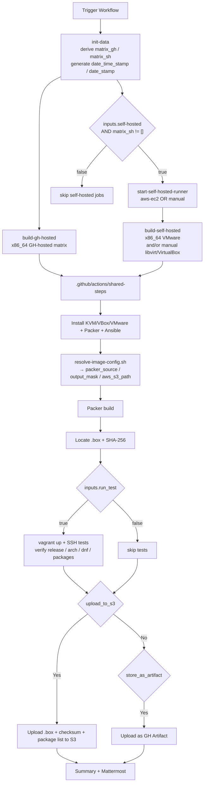
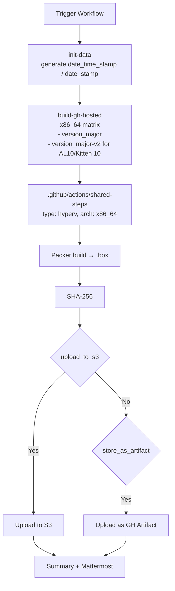

# Build Vagrant Boxes (libvirt, VirtualBox, VMware, Hyper-V)

## Overview

This document covers the two GitHub Actions workflows that build AlmaLinux OS Vagrant boxes with Packer:

| Workflow | Display name | Providers / image types | Runners |
| :--- | :--- | :--- | :--- |
| `.github/workflows/vagrant-build.yml` | `Vagrant: Build Box(es)` | `vagrant_libvirt`, `vagrant_virtualbox`, `vagrant_vmware` | GitHub-hosted (x86_64 libvirt/VirtualBox), self-hosted (x86_64 VMware, optionally all providers) |
| `.github/workflows/hyperv-build.yml` | `Vagrant: Build Hyper-V Box` | `hyperv` (a Vagrant box for Microsoft Hyper-V) | GitHub-hosted (x86_64 only) |

Both workflows share the same composite action `.github/actions/shared-steps/action.yml` and the same `.github/scripts/resolve-image-config.sh` helper used by the cloud-image workflows. The key differences from the cloud-image pipeline are:

- **Multiple providers per workflow** — `vagrant-build.yml` picks the provider(s) via its `vagrant_type` input and supports a `self_hosted_runner` choice for manually registered runners.
- **Provider-specific host requirements** — VirtualBox and VMware need KVM unloaded; VMware needs the `vagrant-vmware-utility` service and a licensed VMware Workstation/Fusion install.
- **Real Vagrant testing** — `run_test: true` causes the composite action to `vagrant up` the box and SSH into the guest for post-build verification.
- **x86_64 only** — both workflows build Vagrant boxes only for `x86_64`.
- **Hyper-V has no `self-hosted` input** — the Hyper-V box is built on Linux with QEMU and only targets x86_64 Windows Hyper-V hosts.

For cloud images see [BUILD_IMAGES.md](BUILD_IMAGES.md) (Azure, GenericCloud, OCI, OpenNebula) and [BUILD_GCP.md](BUILD_GCP.md) (Google Cloud). Publishing Vagrant boxes to Vagrant Cloud is documented in [VAGRANT_CLOUD.md](VAGRANT_CLOUD.md).

## Providers and variants

| Box type / `type` | Produced by | Output | x86_64 variants |
| :--- | :--- | :--- | :--- |
| `vagrant_libvirt` | `vagrant-build.yml` | `.box` | `8`, `9`, `10`, `10-v2`, `10-kitten`, `10-kitten-v2` |
| `vagrant_virtualbox` | `vagrant-build.yml` | `.box` | `8`, `9`, `10`, `10-v2`, `10-kitten`, `10-kitten-v2` |
| `vagrant_vmware` | `vagrant-build.yml` | `.box` | `8`, `9`, `10`, `10-v2`, `10-kitten`, `10-kitten-v2` |
| `hyperv` | `hyperv-build.yml` | `.box` | `8`, `9`, `10`, `10-v2`, `10-kitten`, `10-kitten-v2` |

All Vagrant boxes are built for `x86_64` only.

Variant-suffix meaning (shared with cloud images):

- `-v2` — x86_64_v2 microarchitecture level; available for AL10 and Kitten 10.

## Workflow inputs

### `vagrant-build.yml`

| Input | Type | Default | Notes |
| :--- | :--- | :--- | :--- |
| `date_time_stamp` | string | auto | Shared timestamp for every matrix leg. |
| `version_major` | choice | `10` | `10-kitten`, `10`, `9`, `8`. |
| `vagrant_type` | choice | `ALL` | `ALL`, `vagrant_libvirt`, `vagrant_virtualbox`, `vagrant_vmware`. Controls which provider(s) are built. |
| `self-hosted` | boolean | `true` | Enables the VMware / "manual runner" matrix. Set to `false` to only build GH-hosted libvirt/VirtualBox. |
| `self_hosted_runner` | choice | `aws-ec2` | `aws-ec2` provisions ephemeral EC2 runners; `self-hosted` targets a manually registered runner. See [below](#self_hosted_runner--aws-ec2-vs-self-hosted). |
| `run_test` | boolean | `true` | Run `vagrant up` + SSH-based smoke tests on every built box. |
| `store_as_artifact` | boolean | `false` | Upload boxes as GitHub Actions artifacts. |
| `upload_to_s3` | boolean | `true` | Upload boxes + checksum + package list to the configured S3 bucket. |
| `notify_mattermost` | boolean | `true` | Post a build summary to Mattermost. |

### `hyperv-build.yml`

Same shape **without** `vagrant_type`, `self-hosted`, `self_hosted_runner`, or `run_test`. Hyper-V is always built on an x86_64 GH-hosted runner and not `vagrant up`-tested.

## Job layout

### `vagrant-build.yml`



#### `init-data`

Runs on `ubuntu-24.04`. In addition to emitting the shared timestamp, it derives two matrix arrays consumed by the later jobs:

- `matrix_gh` — providers that should run on GitHub-hosted runners (default: libvirt + VirtualBox when available on GH hosts).
- `matrix_sh` — providers that should run on self-hosted runners (always includes `vagrant_vmware-x86_64`; includes libvirt/VirtualBox when `self_hosted_runner == 'self-hosted'`).

The logic lives in the `set-matrix` step of the `init-data` job in [`.github/workflows/vagrant-build.yml`](.github/workflows/vagrant-build.yml) (search for `id: set-matrix`).

#### `build-gh-hosted` (x86_64 GH-hosted)

Runs on a GitHub-hosted Ubuntu 24.04 runner, or a RunsOn metal instance (`c7i.metal-24xl+c7a.metal-48xl+*8gd.metal*` / `image=ubuntu24-full-x64`) inside the AlmaLinux org. Matrix dimension is `(variant × matrix_gh)` — typically `{8 | 9 | 10[-v2] | 10-kitten[-v2]} × {vagrant_libvirt-x86_64, vagrant_virtualbox-x86_64}`. Each leg parses `matrix_gh` into `type` and `arch` env vars, then delegates to `./.github/actions/shared-steps` with `runner: 'aws-ec2'` (AlmaLinux org) or `'gh_hosted'` (forks).

#### `start-self-hosted-runner`

Runs on `ubuntu-24.04`. Gated by `inputs.self-hosted && matrix_sh != '[]'`. Fan-out matches `matrix_sh × variant`. When `self_hosted_runner == 'aws-ec2'` **and** the repository is not under `AlmaLinux` org, provisions a `c5n.metal` EC2 instance (needed for nested-virt VMware builds) via [`NextChapterSoftware/ec2-action-builder@v1.10`](https://github.com/NextChapterSoftware/ec2-action-builder) with a 30-minute TTL. When `self_hosted_runner == 'self-hosted'` the step is skipped — the runner is expected to already exist.

#### `build-self-hosted`

Dispatches the same `matrix_sh × variant` matrix onto the self-hosted runner. The `runs-on:` expression selects one of three targets in order:

1. `runs-on={RUN_ID}/family=c5n.metal/ami=${vars.EC2_AMI_ID_AL9_X86_64}` for AlmaLinux-org runs (RunsOn provisions a VMware-ready host).
2. `github.run_id` for fork runs with `self_hosted_runner == 'aws-ec2'` (targets the runner just launched above).
3. `matrix.matrix_sh` (e.g. `vagrant_vmware-x86_64`) for fork runs with `self_hosted_runner == 'self-hosted'` (targets the pre-registered runner by its label). The `set-matrix` step of the `init-data` job in [`.github/workflows/vagrant-build.yml`](.github/workflows/vagrant-build.yml) (search for `id: set-matrix`) shows the exact `./config.sh` invocation expected for each provider — register the runner on a machine you control with a label that matches the `matrix_sh` entry one-to-one:

   - **libvirt** — add `vagrant_libvirt-x86_64` to `matrix_sh` only when `self-hosted: true` *and* `self_hosted_runner: self-hosted`; otherwise libvirt builds on the GH-hosted x86_64 runner. Register with:
     ```bash
     ./config.sh --url https://github.com/almalinux/cloud-images --token ***** \
       --name vagrant_libvirt-x86_64 --labels vagrant_libvirt-x86_64 \
       --no-default-labels --work _work --runnergroup default --replace
     ```
   - **VirtualBox** — same rule as libvirt. Register with:
     ```bash
     ./config.sh --url https://github.com/almalinux/cloud-images --token ***** \
       --name vagrant_virtualbox-x86_64 --labels vagrant_virtualbox-x86_64 \
       --no-default-labels --work _work --runnergroup default --replace
     ```
   - **VMware** — always lands on `matrix_sh` because VMware has networking issues on GH runners. It runs either on the `aws-ec2` runner (default, uses an AMI with VMware pre-installed) or on your manually registered runner when `self_hosted_runner: self-hosted`. Register with:
     ```bash
     ./config.sh --url https://github.com/almalinux/cloud-images --token ***** \
       --name vagrant_vmware-x86_64 --labels vagrant_vmware-x86_64 \
       --no-default-labels --work _work --runnergroup default --replace
     ```

   Full host prerequisites for each provider are listed in [Registering a manual self-hosted runner](#registering-a-manual-self-hosted-runner) below.

A **Clean up runner** step (`sudo rm -rf ansible .vagrant output-*`) runs before checkout when targeting a manual runner so stale Packer state from a previous build doesn't leak into the new run.

### `hyperv-build.yml`

Simpler two-job layout — no self-hosted path at all:



`run_test` is hardcoded to `'false'` — the Hyper-V box cannot be `vagrant up`-ed on the Linux build host.

## `self_hosted_runner` — `aws-ec2` vs. `self-hosted`

`vagrant-build.yml` exposes a `self_hosted_runner` choice input. Only `vagrant-build.yml` has this input — `hyperv-build.yml` doesn't need it (no self-hosted path) and the cloud-image workflows in [BUILD_IMAGES.md](BUILD_IMAGES.md) and [BUILD_GCP.md](BUILD_GCP.md) always use `aws-ec2`-style ephemeral runners.

| Value | What happens |
| :--- | :--- |
| `aws-ec2` *(default)* | The `start-self-hosted-runner` job calls [`ec2-action-builder`](https://github.com/NextChapterSoftware/ec2-action-builder) (or picks RunsOn instances inside the AlmaLinux org) to launch an ephemeral EC2 instance, register it as a GitHub runner, and tear it down when the matrix completes. No manual setup is needed. |
| `self-hosted` | The workflow expects a runner that **you have already provisioned and registered** with labels that exactly match the variant name (e.g. `vagrant_libvirt-x86_64`). `start-self-hosted-runner` becomes a no-op; the matrix jobs target the pre-existing runner via those labels. |

In practice you use `aws-ec2` for fully automated CI and `self-hosted` when you need a physical host (e.g. a VMware Workstation license attached to a specific machine, or a provider that isn't trivially available on EC2).

## Registering a manual self-hosted runner

On a machine you control, install the GitHub Actions runner following [GitHub's docs](https://docs.github.com/en/actions/hosting-your-own-runners/managing-self-hosted-runners/adding-self-hosted-runners), then register it with a label that matches the variant — the label format is `<vagrant_type>-<arch>`.

The composite action [`./.github/actions/shared-steps`](.github/actions/shared-steps/action.yml) installs the full virtualisation stack automatically on every run (qemu-kvm, VirtualBox 7.1 from Oracle's repo, the VMware Workstation bundle, Hashicorp-repo Packer, Ansible, udev rules, `kvm` group membership, KVM module unload for VirtualBox/VMware, etc.). The manual runner therefore only needs:

- An x86_64 Linux host with **hardware virtualisation** enabled in firmware (`vmx` / `svm` CPU flag) and **nested virtualisation** turned on for the KVM modules. Recommended OS is **Ubuntu 24.04** for libvirt/VirtualBox runners and **AlmaLinux 9.x** for the VMware runner — see each provider's prerequisites below.
- The runner user able to `sudo` without a password prompt (the workflow's install steps and `packer build` all call `sudo`).
- The runner installed at `/actions-runner/` and registered with `--work _work` so the workflow's working directory resolves to `/actions-runner/_work/cloud-images/` (this path is hard-coded in the VMware bundle step).

### Vagrant libvirt (x86_64)

```bash
./config.sh \
  --url https://github.com/almalinux/cloud-images \
  --token ***** \
  --name vagrant_libvirt-x86_64 \
  --labels vagrant_libvirt-x86_64 \
  --no-default-labels \
  --work _work \
  --runnergroup default \
  --replace
```

Host prerequisites: hardware virtualisation only — `qemu-kvm`, Packer, Ansible and the `kvm` group membership are installed automatically by the composite action on each run. **Ubuntu 24.04** is the recommended host OS (matches the GH-hosted `build-gh-hosted` runner).

### Vagrant VirtualBox (x86_64)

```bash
./config.sh \
  --url https://github.com/almalinux/cloud-images \
  --token ***** \
  --name vagrant_virtualbox-x86_64 \
  --labels vagrant_virtualbox-x86_64 \
  --no-default-labels \
  --work _work \
  --runnergroup default \
  --replace
```

Host prerequisites: hardware virtualisation only — VirtualBox 7.1 is installed from Oracle's Debian repo on every run, and the workflow unloads the KVM modules before the build (VirtualBox clashes with KVM on the same kernel). Just make sure no other process is holding `kvm_intel` / `kvm_amd` open when the build starts. **Ubuntu 24.04** is the recommended host OS — the VirtualBox repo step targets the Oracle `.deb` packages for that release.

VirtualBox `vagrant up` tests don't reliably run on stock GitHub-hosted runners (nested virtualisation limitations), so a manual runner is the recommended way to build *and* test this provider.

### Vagrant VMware Desktop (x86_64)

```bash
./config.sh \
  --url https://github.com/almalinux/cloud-images \
  --token ***** \
  --name vagrant_vmware-x86_64 \
  --labels vagrant_vmware-x86_64 \
  --no-default-labels \
  --work _work \
  --runnergroup default \
  --replace
```

Host prerequisites:

- **AlmaLinux 9.x** is the recommended host OS — the composite action's `rhel` branch (dnf-based package install) is validated on AL9, and the `aws-ec2` path uses an AL9 AMI (`vars.EC2_AMI_ID_AL9_X86_64`).
- Hardware virtualisation enabled (the workflow unloads KVM modules before building, so nothing else must be holding them).
- **VMware Workstation installation bundle** pre-staged at `/actions-runner/_work/cloud-images/VMware-Workstation-Full-<ws_version>-<ws_build>.x86_64.bundle.tar` (currently `17.6.3-24583834`). The direct Broadcom download URL is not publicly accessible anymore, so the `Install VMware` step in [`.github/actions/shared-steps/action.yml`](.github/actions/shared-steps/action.yml) (search for `name: Install VMware`) copies the bundle from that path instead of fetching it. The composite action then extracts the bundle and runs `--console --eulas-agreed --required` to install Workstation itself — no need to pre-install it, just make the `.bundle.tar` available.

> **When VMware builds on `aws-ec2`:** inside the AlmaLinux org the workflow uses a dedicated AMI (`vars.EC2_AMI_ID_AL9_X86_64`) that already has the bundle staged at the same path. Forks without that AMI must use `self_hosted_runner: self-hosted` and stage the bundle themselves.

### Registration token

Generate a one-shot registration token in the repo under *Settings → Actions → Runners → New self-hosted runner* and substitute it for `*****`.

> **Labels must match exactly** and `--no-default-labels` is required. If the matrix leg's label doesn't find a registered runner with that exact label set, the job will sit in `Queued` state forever.

## Image testing

Unlike the cloud-image workflows, `vagrant-build.yml` runs an actual boot + SSH test when `run_test: true`:

1. Install Vagrant and the appropriate provider plugin (`vagrant-libvirt`, default VirtualBox provider, or `vagrant-vmware-desktop`).
2. Add the built `.box` locally.
3. Generate a minimal `Vagrantfile` with 2 vCPU / 2 GiB RAM.
4. `vagrant up` with the correct provider.
Note: the `vagrant up` may not work on stock GH runner, so the VirtualBox *test* will fail.
5. Verify `/etc/almalinux-release` over SSH.
6. Verify the runtime architecture over SSH.
7. `dnf check-update` inside the VM to confirm repository access.
8. Capture the installed RPM package list.
9. `vagrant destroy -f` + `vagrant box remove` to clean up.

`hyperv-build.yml` hard-codes `run_test: 'false'` — see [Job layout → hyperv-build.yml](#hyperv-buildyml) above.

## S3 upload layout

Mirrors the cloud-image workflows:

```
s3://{AWS_S3_BUCKET}/images/{version_major}/{release}/{type}/{timestamp}/
```

Examples:

```
s3://almalinux-cloud/images/9/9.6/vagrant/20260220143000/AlmaLinux-9-Vagrant-libvirt-9.6-20260220.0.x86_64.box
s3://almalinux-cloud/images/10/10.1/vagrant/20260220143000/AlmaLinux-10-Vagrant-vmware-10.1-20260220.0.x86_64_v2.box
s3://almalinux-cloud/images/kitten/10/hyperv/20260220143000/AlmaLinux-Kitten-Vagrant-hyperv-10-20260220.0.x86_64.box
```

All uploaded objects are tagged `public=yes`. Downstream publishing to Vagrant Cloud (HCP) is handled by the separate `vagrant-publish.yml` workflow, documented in [VAGRANT_CLOUD.md](VAGRANT_CLOUD.md).

## Required GitHub configuration

### Secrets

| Secret | Description |
| :--- | :--- |
| `AWS_ACCESS_KEY_ID` | AWS access key for S3 uploads and EC2 runner provisioning |
| `AWS_SECRET_ACCESS_KEY` | AWS secret key |
| `GIT_HUB_TOKEN` | GitHub PAT for Packer plugins and self-hosted runner registration |
| `MATTERMOST_WEBHOOK_URL` | Mattermost incoming webhook URL |
| `EC2_AMI_ID_AL9_X86_64` | AMI ID for the x86_64 self-hosted EC2 runner (used by `aws-ec2`-path VMware builds) |
| `EC2_SUBNET_ID` | EC2 subnet for self-hosted runners |
| `EC2_SECURITY_GROUP_ID` | EC2 security group for self-hosted runners |

### Variables (`vars.*`)

| Variable | Description |
| :--- | :--- |
| `AWS_REGION` | AWS region for S3 and EC2 |
| `AWS_S3_BUCKET` | S3 bucket for box uploads |
| `MATTERMOST_CHANNEL` | Mattermost channel for notifications |
| `EC2_AMI_ID_AL9_X86_64` | AMI ID for RunsOn x86_64 VMware-ready runners (AlmaLinux org only) |

## Troubleshooting

1. **Vagrant job sits in `Queued` forever** — the label on the manual runner doesn't match `matrix_sh` exactly. Double-check the `--labels` argument to `./config.sh` and that `--no-default-labels` was passed.
2. **`vagrant up` fails with SSH timeout (libvirt/VirtualBox/VMware)** — known flake; re-run the job.
3. The `packer build` for **VirtualBox** sits on **`Waiting for SSH to become available...`**, and then fails in an hour because of **`Timeout waiting for SSH.`**. That's a known issue. Re-run the job.
4. **VirtualBox or VMware build fails with "VT-x is disabled"** — KVM is still loaded. The workflow tries to unload `kvm_intel` / `kvm_amd` automatically; if another process is holding the modules open the unload is a no-op. Stop any nested VMs on the host and re-run.
5. **VMware Install step fails with `No such file or directory` on the bundle tarball** — the VMware Workstation bundle isn't staged at `/actions-runner/_work/cloud-images/VMware-Workstation-Full-<ws_version>-<ws_build>.x86_64.bundle.tar`. Download it once (matching the `ws_version` / `ws_build` values at the top of the `Install VMware` step in [`.github/actions/shared-steps/action.yml`](.github/actions/shared-steps/action.yml)) and place it at that path on the runner.
6. **`hyperv-build.yml` can't find the Packer template** — double-check the `version_major` input; Hyper-V builds only the variants listed in the table above.
7. **S3 upload fails** — check `AWS_ACCESS_KEY_ID` / `AWS_SECRET_ACCESS_KEY` have `s3:PutObject` + `s3:PutObjectTagging` on the bucket and that `AWS_REGION` matches the bucket region.
8. **Leftover files on manual runner** — the **Clean up runner** step removes `ansible/`, `.vagrant/`, and `output-*/`. If you're sharing the host across providers, you may also want to run `vagrant box prune` periodically.

## See also

- [VAGRANT_CLOUD.md](VAGRANT_CLOUD.md) — publish built boxes to Vagrant Cloud (HCP).
- [VMWARE_OVA.md](VMWARE_OVA.md) — convert a Vagrant VMware `.box` into a vSphere/ESXi `.ova`.
- [BUILD_IMAGES.md](BUILD_IMAGES.md) — Azure / GenericCloud / OCI / OpenNebula cloud-image builds.
- [BUILD_GCP.md](BUILD_GCP.md) — GCP cloud-image builds.
- Packer documentation: https://developer.hashicorp.com/packer/docs
- Vagrant documentation: https://developer.hashicorp.com/vagrant/docs
