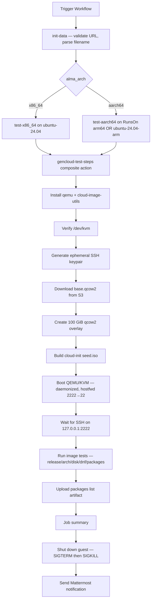

# GenericCloud Image Testing

## Overview

This repository includes a GitHub Actions workflow for post-build sanity-testing AlmaLinux OS GenericCloud (`.qcow2`) images. Unlike the cloud-API counterparts ([`AZURE_TEST.md`](AZURE_TEST.md), [`OCI_TEST.md`](OCI_TEST.md)) which spawn a VM in the respective cloud, this workflow boots the image **directly under QEMU/KVM on the runner** with a cloud-init seed ISO, runs a small set of release / arch / disk / `dnf` assertions over SSH, collects the installed-package list, shuts the guest down on `always()`, and posts a Mattermost summary.

Both x86_64 and aarch64 images are supported; the matching architecture-specific job is selected from the parsed image filename.

## Files

### `.github/workflows/gencloud-test.yml`

Workflow for validating a GenericCloud image end-to-end.

**What it does:**
- Accepts an `image_url` from either the build pipeline's public S3 bucket or `repo.almalinux.org`
- Parses the filename for AlmaLinux major / version / datestamp / architecture, and the URL path for `gencloud` vs `gencloud_ext4` subtype
- Picks the right job: `test-x86_64` on `ubuntu-24.04`, or `test-aarch64` on the AlmaLinux org's RunsOn arm64 metal pool (forks fall back to GitHub-hosted `ubuntu-24.04-arm`)
- Delegates the boot/test/cleanup work to the [`gencloud-test-steps`](#githubactionsgencloud-test-stepsactionyml) composite action

**Usage:**
```
Trigger via GitHub UI: Actions → GenericCloud: Test Image

Inputs:
  - image_url:         URL to the .qcow2 image (build's public S3 URL or repo.almalinux.org)
  - notify_mattermost: Send notification to Mattermost (default: true)
```

Two URL shapes are accepted:

| Source | URL pattern | Subtype |
|--------|-------------|---------|
| Build pipeline (pre-publish) | `https://<bucket>.s3-accelerate.dualstack.amazonaws.com/images/<major>/<release>/{gencloud\|gencloud_ext4}/<timestamp>/<filename>.qcow2` | from path segment |
| Official AlmaLinux repo (post-publish) | `https://repo.almalinux.org/almalinux/<major>/cloud/<arch>/images/<filename>.qcow2` | always `gencloud` (only variant published) |

The build workflow [`gencloud-build.yml`](BUILD_IMAGES.md) writes the qcow2 to S3 with a public-read tag and prints the URL into its Mattermost notification — testers copy-paste that URL into the test workflow's `image_url` input. After release, the same image lands at `repo.almalinux.org` and the workflow can re-validate it from there.

### `.github/actions/gencloud-test-steps/action.yml`

Composite action shared by both arch jobs. Per-arch differences (qemu binary, machine type, firmware) are passed through inputs so a single set of steps drives both legs.

**Steps in order:**

1. Install hypervisor packages (`qemu-system-x86` or `qemu-system-arm` + `qemu-efi-aarch64`, `cloud-image-utils`)
2. Verify `/dev/kvm` is present and writable; fail fast if not (the runner lacks nested virt)
3. Generate ephemeral ed25519 keypair
4. Download the base image with `curl --retry 5`
5. Create a 100 GiB qcow2 overlay with the base as backing file
6. Build a `seed.iso` cloud-init datasource (meta-data + user-data injecting the public key)
7. Launch QEMU daemonized with `accel=kvm`, virtio disk/net, SLIRP user-mode networking, and `hostfwd=tcp::2222-:22`
8. Wait for SSH on `127.0.0.1:2222` by looping `ssh-keyscan` (succeeds only once the guest's sshd is actually responding, not just when QEMU's hostfwd accepts the TCP handshake)
9. Run the in-VM assertions (see [Test Assertions](#test-assertions)), `scp` the package list back
10. Upload the package list as a workflow artifact
11. Dump `console.log` if the job failed (so debugging doesn't need an artifact upload)
12. Write the Step Summary
13. Send `SIGTERM` to the QEMU pid (graceful guest powerdown via ACPI), `SIGKILL` after a 15 s grace period
14. Post the Mattermost notification

## Required GitHub Configuration

### Secrets
| Secret | Description |
|--------|-------------|
| `MATTERMOST_WEBHOOK_URL` | Mattermost incoming webhook URL |

No AWS/Azure/OCI credentials are required: the build pipeline writes the qcow2 to S3 with `TagSet={Key=public,Value=yes}` (see [`shared-steps/action.yml`](.github/actions/shared-steps/action.yml)), so the URL is publicly fetchable.

### Variables (`vars.*`)
| Variable | Description |
|----------|-------------|
| `MATTERMOST_CHANNEL` | Mattermost channel for notifications |

### GitHub Permissions
The workflow only needs `contents: read` (for repository checkout). No `id-token: write`, no cloud login.

## Image Filename Parsing

The image filename is parsed against two regexes (the same shape distinction the build pipeline makes between stable AlmaLinux and Kitten). Three trailing segments are optional:

- `.<iter>` — same-day re-run iteration on the datestamp (e.g. `20260502.0`).
- `-ext4` — present in `repo.almalinux.org` filenames for the ext4 variant.
- `_v2` — x86_64_v2 microarchitecture-level variant (AL10 / Kitten).

`ALMA_ARCH` is captured as the base arch (`x86_64` / `aarch64`) only, so the QEMU case statement and the in-VM `rpm --qf '%{ARCH}'` grep stay correct. The `_v2` suffix is allowed but not extracted.

```
^AlmaLinux-([0-9]+)-GenericCloud(-ext4)?-([0-9]+\.[0-9]+)-([0-9]+(\.[0-9]+)?)\.(x86_64|aarch64)(_v2)?\.qcow2$
^AlmaLinux-Kitten-GenericCloud(-ext4)?-([0-9]+)-([0-9]+(\.[0-9]+)?)\.(x86_64|aarch64)(_v2)?\.qcow2$
```

| Component | Stable example | Stable ext4 example | Kitten example |
|-----------|----------------|---------------------|----------------|
| `IMAGE_FILENAME` | `AlmaLinux-10-GenericCloud-10.1-20260502.0.x86_64.qcow2` | `AlmaLinux-10-GenericCloud-ext4-10.1-20260501.0.x86_64.qcow2` | `AlmaLinux-Kitten-GenericCloud-10-20260502.0.aarch64.qcow2` |
| `ALMA_MAJOR` | `10` | `10` | `10` |
| `ALMA_VERSION` | `10.1` | `10.1` | `10` |
| `ALMA_DATE` | `20260502.0` | `20260501.0` | `20260502.0` |
| `ALMA_ARCH` | `x86_64` | `x86_64` | `aarch64` |
| `RELEASE_STRING` | `AlmaLinux release 10.1` | `AlmaLinux release 10.1` | `AlmaLinux Kitten release 10` |

Subtype detection is two-stage: it reads the URL path first (`/gencloud_ext4/` or `/gencloud/` for the build's S3 layout, where both variants share the on-disk filename — see [`.github/scripts/resolve-image-config.sh`](.github/scripts/resolve-image-config.sh) at the `gencloud_ext4_*` cases), and falls back to the filename's `-GenericCloud-ext4-` substring for the `repo.almalinux.org` layout.

Filenames or paths that don't match abort the workflow at the parse step before any image is downloaded.

## Architecture → Runner Mapping

| Architecture | Runner (AlmaLinux org) | Runner (forks) |
|---|---|---|
| `x86_64` | `ubuntu-24.04` (GitHub-hosted) | `ubuntu-24.04` |
| `aarch64` | RunsOn metal pool — `c7i.metal-24xl+c7a.metal-48xl+*8gd.metal*`, `image=ubuntu24-full-arm64` | `ubuntu-24.04-arm` (GitHub-hosted) |

Both legs land on Ubuntu 24.04, so the composite action uses a single `apt-get install` path and only the QEMU invocation differs.

## QEMU Invocation

| Knob | x86_64 | aarch64 |
|------|--------|---------|
| Binary | `qemu-system-x86_64` | `qemu-system-aarch64` |
| Machine | `-machine q35,accel=kvm -cpu host` | `-machine virt,accel=kvm -cpu host` |
| Firmware | (default SeaBIOS) | `-bios /usr/share/AAVMF/AAVMF_CODE.fd` |
| CPU / RAM | `-smp 2 -m 2048` | `-smp 2 -m 2048` |
| Disk | `disk.qcow2` (100 GiB overlay) over `base.qcow2` | same |
| Cloud-init | `seed.iso` mounted as a second virtio block device | same |
| Networking | `-netdev user,hostfwd=tcp::2222-:22 -device virtio-net-pci` | same |
| Console | `-display none -serial file:console.log` | same |

User-mode (SLIRP) networking is used deliberately: it needs no root, no bridge, no tap device, and yields a clean `localhost:2222 → guest:22` redirect that works on every runner.

The 100 GiB virtual size on the overlay (the base image is ~500 MiB; the overlay stays sparse) gives `cloud-init` / `growpart` enough room to satisfy the ≥ 98 GiB root-FS-resize assertion without wasting real disk on the runner.

## Test Assertions

Once SSH is reachable on the guest, the following checks run in sequence (failure of any aborts the workflow):

1. **AlmaLinux release** — `grep '<RELEASE_STRING>' /etc/almalinux-release`
2. **System architecture** — `rpm -q --qf='%{ARCH}\n' almalinux-release | grep '<ALMA_ARCH>'`
3. **Disk and filesystems** — `lsblk` listing
4. **Root filesystem resize** — root must be ≥ 95 GiB (the overlay is 100 GiB; the QEMU image's UEFI layout — 1M BIOS-boot + 200M `/boot/efi` + 1G `/boot` — plus ext4/xfs metadata trims the observed ceiling on a fully-grown root to ~97 GiB)
5. **Root filesystem type (gencloud_ext4 only)** — `findmnt -no FSTYPE /` must return `ext4`. Skipped for the XFS `gencloud` subtype.
6. **Updates available** — `sudo dnf check-update` (exit code `100` is treated as success — it just means updates are pending)
7. **Installed-package list** — `rpm -qa --queryformat '%{NAME}\n' | sort > /tmp/<IMAGE_FILENAME>.txt`, then SCP'd back and uploaded as a workflow artifact

These mirror the assertions [`oci-test.yml`](OCI_TEST.md) and [`azure-test.yml`](AZURE_TEST.md) run, plus the `gencloud_ext4`-specific root-FS-type check that those siblings can't make (Azure / OCI only publish the XFS variant).

## Workflow Process



## Testing

1. **First dispatch against an x86_64 image:**
   - Copy the `image_url` line from a recent `gencloud-build.yml` Mattermost summary
   - Confirm green run, package-list artifact, and Mattermost summary

2. **aarch64 dispatch:**
   - Same flow with an aarch64 URL — confirms the `qemu-system-aarch64` + AAVMF path

3. **Bad-URL guard:**
   - Dispatch with a URL whose path lacks `/gencloud/` or `/gencloud_ext4/`, or whose filename doesn't match either regex — workflow must abort at the parse step before any download.

## Troubleshooting

### Common Issues

1. **"image_url must be an http(s) URL" / "URL path must contain '/gencloud/' or '/gencloud_ext4/'" / "Unexpected GenericCloud filename"**
   - Input validation rejected the URL before any image fetch. Confirm the URL came from a `gencloud-build.yml` run, not a different image type.

2. **"/dev/kvm not present on this runner; nested KVM is required"**
   - The runner lacks nested virtualization. The AlmaLinux-org RunsOn metal pool always exposes `/dev/kvm`. The free GitHub-hosted x64 runners gained `/dev/kvm` in November 2024; arm64 hosted runners (`ubuntu-24.04-arm`) availability is best-effort. If a fork hits this on aarch64, swap to a self-hosted aarch64 host or accept the gap.

3. **`curl` download fails / 403**
   - The S3 object lost its `public=yes` tag, or the build emitted an unexpected URL. Re-fetch the URL from the build's Mattermost summary; if forced-private, retrofit signed downloads (the workflow does not currently take AWS credentials).

4. **"SSH did not become reachable within 10 minutes"**
   - cloud-init didn't bring up sshd in time, or never finished. Inspect the dumped `console.log` (printed automatically on failure) — typical causes: image missing default user provisioning, qcow2 corruption, or cloud-init datasource not picking up the seed ISO.

5. **"Root filesystem resize check failed"**
   - Root FS did not auto-grow to ≥ 98 GiB on a 100 GiB overlay. Indicates a `cloud-init` / `growpart` / `xfs_growfs` (or `resize2fs` for `gencloud_ext4`) regression in the image.

6. **`dnf check-update` exits with non-100, non-0 code**
   - Repo metadata fetch failure or signed metadata mismatch. Re-run; if persistent, check that the image's repo data is current and that user-mode networking is reaching the upstream mirrors (SLIRP DNS / NAT).

7. **QEMU "could not access KVM kernel module"**
   - The kvm module is loaded but `/dev/kvm` permissions are too restrictive for the runner user. The composite action `chmod 666`s the device when the runner user can't write to it; if that step has been removed, re-add it.

### Linter Warnings

The lint workflow's shellcheck pass runs with `-S warning`, so info-level findings (`SC2086` "unquoted `$var`", etc.) don't block CI. The shell snippets here follow the same conventions as the existing `oci-test.yml` / `azure-test.yml` and are clean at warning severity.

## Notes for Future Maintainers

- **Keep the assertions in sync with `oci-test.yml` / `azure-test.yml`.** A test that exists in one but not the others is a missed regression in two clouds.
- **The 100 GiB overlay is deliberate.** Smaller virtual sizes will fail the root-FS-resize assertion; larger sizes don't help.
- **No checksum verification (`.sha256sum`).** Add it as a follow-up if download corruption is ever observed; the build pipeline already produces the sidecar file.
