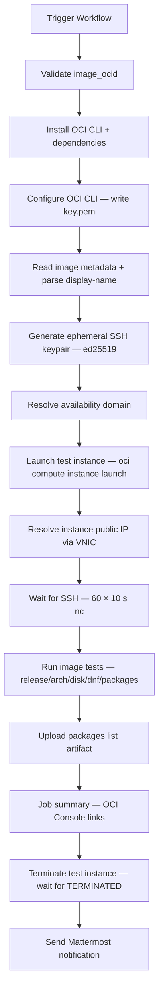

# Oracle Cloud Infrastructure Compute Image Testing

## Overview

This repository includes a GitHub Actions workflow for post-publish sanity-testing AlmaLinux OS Compute Custom Images on Oracle Cloud Infrastructure. The workflow launches a fresh test instance from a given Compute Image OCID, runs a small set of release / arch / disk / `dnf` assertions over SSH, collects the installed-package list, terminates the instance on `always()`, and posts a Mattermost summary.

It is the OCI counterpart of [`AZURE_TEST.md`](AZURE_TEST.md).

## Files

### `.github/workflows/oci-test.yml`

Workflow for validating an OCI Compute Custom Image end-to-end.

**What it does:**
- Accepts an `image_ocid` (e.g. `ocid1.image.oc1..<unique_id>`)
- Reads the image `display-name` and parses it for AlmaLinux major/version/datestamp/architecture
- Maps architecture to an OCI shape (`x86_64` → `VM.Standard.E5.Flex`, `aarch64` → `VM.Standard.A1.Flex`)
- Generates an ephemeral ed25519 SSH keypair, launches a test instance with a public IP, waits for SSH, runs the assertions, then terminates the instance
- Uploads the package list as a workflow artifact
- Sends a Mattermost notification with OCI Console links to the image and the (now-terminated) test instance

**Usage:**
```
Trigger via GitHub UI: Actions → OCI: Test Image

Inputs:
  - image_ocid:        Compute Image OCID (must start with ocid1.image.)
  - notify_mattermost: Send notification to Mattermost (default: true)
```

The release workflow [`oci-marketplace-publish.yml`](OCI_MARKETPLACE.md) creates the Compute Custom Image whose OCID this workflow consumes.

## Required GitHub Configuration

### Secrets
| Secret | Description |
|--------|-------------|
| `OCI_CLI_USER` | OCI user OCID |
| `OCI_CLI_TENANCY` | OCI tenancy OCID |
| `OCI_CLI_FINGERPRINT` | API key fingerprint |
| `OCI_CLI_KEY_CONTENT` | Private API key content (PEM) |
| `OCI_COMPARTMENT_ID` | Compartment OCID for the test instance |
| `OCI_SUBNET_ID` | Public subnet OCID in `OCI_CLI_REGION` |
| `MATTERMOST_WEBHOOK_URL` | Mattermost incoming webhook URL |

### Variables (`vars.*`)
| Variable | Description |
|----------|-------------|
| `OCI_CLI_REGION` | OCI region (e.g. `us-ashburn-1`) |
| `MATTERMOST_CHANNEL` | Mattermost channel for notifications |

### Workflow-level `env`
| Env | Value |
|-----|-------|
| `OCI_COMPUTE_BASE_URL` | `https://cloud.oracle.com/compute` |
| `SSH_USER` (job-level) | `opc` |

## Custom Image Name Parsing

The Compute Image's `display-name` is parsed against a strict regex:

```
^AlmaLinux-(<major>)-OCI-(<version>)-(<datestamp>[.<iter>])\.(x86_64|aarch64)$
```

| Component | Example |
|-----------|---------|
| `ALMA_MAJOR` | `10` |
| `ALMA_VERSION` | `10.1` |
| `ALMA_DATE` | `20260502.0` |
| `ALMA_ARCH` | `x86_64` or `aarch64` |
| `RELEASE_STRING` | `AlmaLinux release <ALMA_VERSION>` |

Display names that do not match this pattern fail the workflow at the parse step before any OCI resources are touched.

## Architecture → Shape Mapping

| Architecture | Shape | Config |
|---|---|---|
| `x86_64` | `VM.Standard.E5.Flex` | 2 OCPU / 8 GiB |
| `aarch64` | `VM.Standard.A1.Flex` | 2 OCPU / 8 GiB |

Boot volume is set to 100 GiB so the root-filesystem-resize assertion (≥ 98 GiB) has headroom.

## Test Assertions

Once SSH is reachable on the test instance, the following checks run in sequence (failure of any aborts the workflow):

1. **AlmaLinux release** — `grep '<RELEASE_STRING>' /etc/almalinux-release`
2. **System architecture** — `rpm -q --qf='%{ARCH}\n' almalinux-release | grep '<ALMA_ARCH>'`
3. **Disk and filesystems** — `lsblk` listing
4. **Root filesystem resize** — root must be ≥ 98 GiB (the boot-volume-size-in-gbs is 100 GiB)
5. **Updates available** — `sudo dnf check-update` (exit code `100` is treated as success — it just means updates are pending)
6. **Installed-package list** — `rpm -qa --queryformat '%{NAME}\n' | sort > /tmp/<CUSTOM_IMAGE_NAME>.txt`, then SCP'd back and uploaded as a workflow artifact

## Workflow Process



## Instance Lifecycle

The test instance is named `oci-test-${ALMA_VERSION}-${ALMA_DATE}-${ALMA_ARCH}-${GITHUB_RUN_ID}` (`GITHUB_RUN_ID` keeps concurrent dispatches collision-free).

The `Terminate test instance` step runs under `if: always() && env.INSTANCE_OCID != ''`:

```bash
oci compute instance terminate \
  --instance-id "${INSTANCE_OCID}" \
  --force \
  --wait-for-state TERMINATED
```

OCI's `terminate` deletes the instance, the boot volume (because we created it inline rather than from a separate volume), and the auto-attached VNIC, so no per-resource cleanup is needed.

## Testing

1. **First dispatch against an x86_64 image:**
   - Use the OCID of a recently imported AlmaLinux 10 OCI image
   - Confirm green run, package-list artifact, and Mattermost summary

2. **aarch64 dispatch:**
   - Same flow with an aarch64 OCID — confirms the `VM.Standard.A1.Flex` shape path

3. **Cleanup verification:**
   - After the run, search instances in the compartment for the run ID:
     ```bash
     oci compute instance list \
       --compartment-id "$OCI_COMPARTMENT_ID" \
       --query "data[?contains(\"display-name\", '<run_id>')]"
     ```
     Expected: `[]` (or the instance in `TERMINATED` state).

## Troubleshooting

### Common Issues

1. **"Invalid Compute Image OCID"**
   - The OCID must start with `ocid1.image.`. Other OCID types (`ocid1.compute-image-version`, `ocid1.marketplacepublisherartifact`, etc.) are rejected at the validate step.

2. **"Unexpected Custom Image Name"**
   - The image's `display-name` did not match the `AlmaLinux-<major>-OCI-<version>-<datestamp>[.<iter>].<arch>` pattern. Confirm the image was imported via [`oci-marketplace-publish.yml`](OCI_MARKETPLACE.md), which sets the canonical display name.

3. **Instance launch fails with capacity / quota error**
   - Pick a different shape config (edit the workflow) or wait and re-run. AlmaLinux 10 ARM is in `VM.Standard.A1.Flex` quota which is per-tenancy.

4. **"Instance has no public IP"**
   - The subnet specified in `OCI_SUBNET_ID` is private. The workflow needs a *public* subnet because it SSH's from the GitHub-hosted runner.

5. **"SSH did not become reachable within 10 minutes"**
   - The instance came up but SSH never opened on port 22 from the runner. Possible causes: stateful ingress rule on the subnet's security list / NSG missing for port 22, cloud-init still bringing up `sshd`, or `opc` user not yet provisioned (cloud-init drift).

6. **"Root filesystem resize check failed"**
   - The root filesystem on the test instance did not auto-grow to ≥ 98 GiB. Indicates a `cloud-init` / `growpart` regression in the imported image.

7. **`dnf check-update` exits with non-100, non-0 code**
   - Repo metadata fetch failure or signed metadata mismatch. Re-run; if persistent, check that the image's repo data is current.

8. **"Termination" step times out**
   - OCI is occasionally slow to fully terminate an instance. The workflow runs `--wait-for-state TERMINATED`, so failure here means OCI did not converge — inspect the instance in the OCI Console manually.

### Linter Warnings

GitHub Actions YAML linters may show "Context access might be invalid" warnings for environment variables set via `$GITHUB_ENV`. These are false positives — the workflow functions correctly.

## Support

- OCI Console: https://cloud.oracle.com/compute
- OCI Compute Custom Images docs: https://docs.oracle.com/en-us/iaas/Content/Compute/Tasks/managingcustomimages.htm
- AlmaLinux Cloud SIG Chat: https://chat.almalinux.org/almalinux/channels/sigcloud
- Workflow run logs: GitHub Actions tab in the repository
