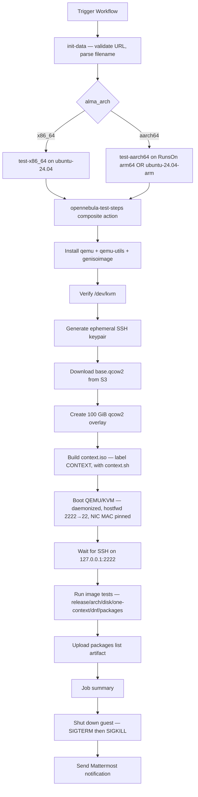

# OpenNebula Image Testing

## Overview

This repository includes a GitHub Actions workflow for post-build sanity-testing AlmaLinux OS OpenNebula (`.qcow2`) images. Like its [`GENCLOUD_TEST.md`](GENCLOUD_TEST.md) sibling — and unlike the cloud-API counterparts ([`AZURE_TEST.md`](AZURE_TEST.md), [`OCI_TEST.md`](OCI_TEST.md)) which spawn a VM in the respective cloud — this workflow boots the image **directly under QEMU/KVM on the runner**, this time with an **OpenNebula `CONTEXT` ISO** (one-context contextualization, not cloud-init), runs a small set of release / arch / disk / `dnf` assertions plus OpenNebula-specific contextualization assertions over SSH, collects the installed-package list, shuts the guest down on `always()`, and posts a Mattermost summary.

Both x86_64 (including `x86_64_v2`) and aarch64 images are supported; the matching architecture-specific job is selected from the parsed image filename.

## Files

### `.github/workflows/opennebula-test.yml`

Workflow for validating an OpenNebula image end-to-end.

**What it does:**
- Accepts an `image_url` from either the build pipeline's public S3 bucket or `repo.almalinux.org`
- Parses the filename for AlmaLinux major / version / datestamp / architecture (including the `x86_64_v2` arch variant)
- Picks the right job: `test-x86_64` on `ubuntu-24.04`, or `test-aarch64` on the AlmaLinux org's RunsOn arm64 metal pool (forks fall back to GitHub-hosted `ubuntu-24.04-arm`)
- Delegates the boot/test/cleanup work to the [`opennebula-test-steps`](#githubactionsopennebula-test-stepsactionyml) composite action

**Usage:**
```
Trigger via GitHub UI: Actions → OpenNebula: Test Image

Inputs:
  - image_url:         URL to the .qcow2 image (build's public S3 URL or repo.almalinux.org)
  - notify_mattermost: Send notification to Mattermost (default: true)
```

Two URL shapes are accepted:

| Source | URL pattern |
|--------|-------------|
| Build pipeline (pre-publish) | `https://<bucket>.s3-accelerate.dualstack.amazonaws.com/images/<major>/<release>/opennebula/<timestamp>/<filename>.qcow2` |
| Official AlmaLinux repo (post-publish) | `https://repo.almalinux.org/almalinux/<major>/cloud/<arch>/images/<filename>.qcow2` |

The build workflow [`opennebula-build.yml`](BUILD_IMAGES.md) writes the qcow2 to S3 with a public-read tag and prints the URL into its Mattermost notification — testers copy-paste that URL into the test workflow's `image_url` input. After release, the same image lands at `repo.almalinux.org` and the workflow can re-validate it from there.

### `.github/actions/opennebula-test-steps/action.yml`

Composite action shared by both arch jobs. Per-arch differences (qemu binary, machine type, firmware) are passed through inputs so a single set of steps drives both legs.

**Steps in order:**

1. Install hypervisor packages (`qemu-system-x86` or `qemu-system-arm` + `qemu-efi-aarch64`, plus `qemu-utils` and `genisoimage`)
2. Verify `/dev/kvm` is present and writable; fail fast if not (the runner lacks nested virt)
3. Generate ephemeral ed25519 keypair
4. Download the base image with `curl --retry 5`
5. Create a 100 GiB qcow2 overlay with the base as backing file
6. Build a `context.iso` (ISO9660, volume label `CONTEXT`) containing `context.sh` with `SET_HOSTNAME`, `USERNAME`, `SSH_PUBLIC_KEY`, `NETWORK="YES"`, `START_SSHD="YES"`, `ETH0_MAC`, `ETH0_METHOD="dhcp"`, `ETH0_IP6_METHOD="skip"`, `ETH0_DNS="10.0.2.3"`
7. Launch QEMU daemonized with `accel=kvm`, virtio disk/net (NIC MAC pinned to match `ETH0_MAC`), SLIRP user-mode networking, and `hostfwd=tcp::2222-:22`
8. Wait for SSH on `127.0.0.1:2222` by looping `ssh-keyscan` (succeeds only once the guest's sshd is actually responding, not just when QEMU's hostfwd accepts the TCP handshake)
9. Run the in-VM assertions (see [Test Assertions](#test-assertions)), `scp` the package list back
10. Upload the package list as a workflow artifact
11. Dump `console.log` if the job failed (so debugging doesn't need an artifact upload)
12. Write the Step Summary
13. Send `SIGTERM` to the QEMU pid (graceful guest powerdown via ACPI), `SIGKILL` after a 15 s grace period
14. Post the Mattermost notification

## Required GitHub Configuration

### Secrets
| Secret | Description |
|--------|-------------|
| `MATTERMOST_WEBHOOK_URL` | Mattermost incoming webhook URL |

No AWS/Azure/OCI credentials are required: the build pipeline writes the qcow2 to S3 with `TagSet={Key=public,Value=yes}` (see [`shared-steps/action.yml`](.github/actions/shared-steps/action.yml)), so the URL is publicly fetchable.

### Variables (`vars.*`)
| Variable | Description |
|----------|-------------|
| `MATTERMOST_CHANNEL` | Mattermost channel for notifications |

### GitHub Permissions
The workflow only needs `contents: read` (for repository checkout). No `id-token: write`, no cloud login.

## Image Filename Parsing

The image filename is parsed against two regexes (the same shape distinction the build pipeline makes between stable AlmaLinux and Kitten). The trailing `.<iter>` on the datestamp is optional — the build pipeline emits the iter for same-day re-runs, while AL8/9 published filenames may omit it. The architecture token is `x86_64`, `x86_64_v2`, or `aarch64`; the `_v2` is part of the arch token (it identifies the v2 microarchitecture baseline build), not a separate filename segment.

```
^AlmaLinux-([0-9]+)-OpenNebula-([0-9]+\.[0-9]+)-([0-9]+(\.[0-9]+)?)\.(x86_64|x86_64_v2|aarch64)\.qcow2$
^AlmaLinux-Kitten-OpenNebula-([0-9]+)-([0-9]+(\.[0-9]+)?)\.(x86_64|x86_64_v2|aarch64)\.qcow2$
```

| Component | Stable example | Stable v2 example | Stable AL9 example | Kitten example |
|-----------|----------------|-------------------|--------------------|----------------|
| `IMAGE_FILENAME` | `AlmaLinux-10-OpenNebula-10.1-20260502.0.x86_64.qcow2` | `AlmaLinux-10-OpenNebula-10.1-20260502.0.x86_64_v2.qcow2` | `AlmaLinux-9-OpenNebula-9.7-20260501.x86_64.qcow2` | `AlmaLinux-Kitten-OpenNebula-10-20260502.0.aarch64.qcow2` |
| `ALMA_MAJOR` | `10` | `10` | `9` | `10` |
| `ALMA_VERSION` | `10.1` | `10.1` | `9.7` | `10` |
| `ALMA_DATE` | `20260502.0` | `20260502.0` | `20260501` | `20260502.0` |
| `ALMA_ARCH_FULL` | `x86_64` | `x86_64_v2` | `x86_64` | `aarch64` |
| `ALMA_ARCH` | `x86_64` | `x86_64` | `x86_64` | `aarch64` |
| `RELEASE_STRING` | `AlmaLinux release 10.1` | `AlmaLinux release 10.1` | `AlmaLinux release 9.7` | `AlmaLinux Kitten release 10` |

`ALMA_ARCH` is the canonical runner tag (`x86_64` or `aarch64`) used to select the test job. `ALMA_ARCH_FULL` is the raw filename token (`x86_64`, `x86_64_v2`, or `aarch64`), used to match `rpm -q --qf='%{ARCH}\n' almalinux-release` (which is `x86_64_v2` on v2 images, since `almalinux-release` is rebuilt per-microarch baseline) and surfaced in the job summary and Mattermost message so v2 builds remain distinguishable.

Filenames or paths that don't match abort the workflow at the parse step before any image is downloaded.

## Architecture → Runner Mapping

| Architecture | Runner (AlmaLinux org) | Runner (forks) |
|---|---|---|
| `x86_64` (incl. `x86_64_v2`) | `ubuntu-24.04` (GitHub-hosted) | `ubuntu-24.04` |
| `aarch64` | RunsOn metal pool — `c7i.metal-24xl+c7a.metal-48xl+*8gd.metal*`, `image=ubuntu24-full-arm64` | `ubuntu-24.04-arm` (GitHub-hosted) |

Both legs land on Ubuntu 24.04, so the composite action uses a single `apt-get install` path and only the QEMU invocation differs.

## QEMU Invocation

| Knob | x86_64 | aarch64 |
|------|--------|---------|
| Binary | `qemu-system-x86_64` | `qemu-system-aarch64` |
| Machine | `-machine q35,accel=kvm -cpu host` | `-machine virt,accel=kvm -cpu host` |
| Firmware | (default SeaBIOS) | `-bios /usr/share/AAVMF/AAVMF_CODE.fd` |
| CPU / RAM | `-smp 2 -m 2048` | `-smp 2 -m 2048` |
| Disk | `disk.qcow2` (100 GiB overlay) over `base.qcow2` | same |
| Contextualization | `context.iso` (ISO9660, label `CONTEXT`) mounted as a second virtio block device | same |
| Networking | `-netdev user,hostfwd=tcp::2222-:22 -device virtio-net-pci,mac=52:54:00:12:34:56` | same |
| Console | `-display none -serial file:console.log` | same |

The NIC MAC is pinned to a fixed locally-administered value (`52:54:00:12:34:56`) and the same value is set as `ETH0_MAC` in `context.sh`. This is load-bearing: see [Why `ETH0_MAC` is required](#why-eth0_mac-is-required) below.

User-mode (SLIRP) networking is used deliberately: it needs no root, no bridge, no tap device, and yields a clean `localhost:2222 → guest:22` redirect that works on every runner.

The 100 GiB virtual size on the overlay (the base image is ~500 MiB; the overlay stays sparse) gives one-context's `loc-05-grow-rootfs` hook enough room to satisfy the ≥ 95 GiB root-FS-resize assertion without wasting real disk on the runner.

## OpenNebula CONTEXT ISO

The contextualization media for OpenNebula is an ISO9660 filesystem with **VOLUME LABEL `CONTEXT`** containing a `context.sh` shell script of `KEY="VALUE"` pairs. one-context inside the guest scans block devices for that label, mounts the ISO, sources `context.sh`, and feeds the variables to the `loc-*` (pre-network) and `net-*` (post-network) hook scripts under `/etc/one-context.d/`.

The composite action emits this `context.sh`:

```sh
SET_HOSTNAME="opennebula-test"
USERNAME="almalinux"
SSH_PUBLIC_KEY="ssh-ed25519 AAAA... opennebula-test-<run_id>"
NETWORK="YES"
START_SSHD="YES"
ETH0_MAC="52:54:00:12:34:56"
ETH0_METHOD="dhcp"
ETH0_IP6_METHOD="skip"
ETH0_DNS="10.0.2.3"
```

ISO is built with `genisoimage -V CONTEXT -J -R context.sh`. one-context recognizes only the volume label, so the on-disk filename of the ISO is irrelevant.

### Why `ETH0_MAC` is required

one-context's `get_context_interfaces` (in `/etc/one-context.d/loc-10-network.d/functions`) enumerates which NICs are "in context" by scanning the environment for `ETH<N>_MAC=` variables:

```sh
get_context_interfaces() (
    env | sed -n 's/^\(ETH[0-9][0-9]*\)_MAC=.*/\1/p' | sort
)
```

Without `ETH0_MAC` defined, `ETH0` does not appear in that list — so the iteration loop in `gen_network_configuration` never runs for `ETH0`, and `ETH0_METHOD="dhcp"` (or any other `ETH0_*` variable) is silently ignored. The guest boots, sshd binds on `0.0.0.0:22`, but `eth0` has no IP and the SLIRP `hostfwd` packets land on a guest with no working route. The visible symptom is `Connection timed out during banner exchange` from the host side.

Pinning the QEMU NIC MAC to a fixed value and setting `ETH0_MAC` to the same value in `context.sh` is what makes one-context create the NetworkManager DHCP profile, bring `eth0` up, and complete contextualization. The hardcoded value (`52:54:00:12:34:56`) is the QEMU-default first-NIC MAC, locally-administered, and safe in this isolated daemonized-guest scenario. If a future runner generation rejects it, the action can be adjusted to generate a fresh locally-administered MAC per run.

## Test Assertions

Once SSH is reachable on the guest, the following checks run in sequence (failure of any aborts the workflow):

1. **AlmaLinux release** — `grep '<RELEASE_STRING>' /etc/almalinux-release`
2. **System architecture** — `rpm -qf /etc/almalinux-release` (resolves to `almalinux-release` for stable AlmaLinux, `almalinux-release-kitten` for Kitten), then `rpm -q --qf='%{ARCH}\n' <pkg> | grep '<ALMA_ARCH_FULL>'` (matches `x86_64_v2` on v2 images — the release package is rebuilt per-microarch baseline, so its `%{ARCH}` reflects the v2 suffix)
3. **Disk and filesystems** — `lsblk` listing
4. **Root filesystem resize** — root must be ≥ 95 GiB (the overlay is 100 GiB; the QEMU image's UEFI layout — 1M BIOS-boot + 200M `/boot/efi` + 1G `/boot` — plus xfs metadata trims the observed ceiling on a fully-grown root to ~97 GiB)
5. **`one-context` package** — `rpm -q one-context` succeeds; the version is captured into the summary / Mattermost message
6. **OpenNebula payload packages** — single `rpm -q` over the full set the build-time `opennebula_guest` Ansible role installs: `almalinux-release-opennebula-addons`, `one-context`, `cloud-utils-growpart`, `parted`, `qemu-guest-agent`, `nfs-utils`, `rsync`, `jq`, `tcpdump`, `tuned`. Fails if any are missing.
7. **`one-context` services** — `systemctl is-active one-context-local.service one-context-online.service one-context.service` returns `active` for all three
8. **CONTEXT volume detection** — `lsblk -o NAME,LABEL,FSTYPE` shows the second virtio block device with `LABEL=CONTEXT` and `FSTYPE=iso9660`
9. **`SET_HOSTNAME` applied** — `hostname` returns `opennebula-test`
10. **`ETH0_METHOD=dhcp` applied** — `ip -4 -o addr show eth0` shows an inet address; `ip route` shows a default route (the symptom from the [`ETH0_MAC` discussion above](#why-eth0_mac-is-required))
11. **Updates available** — `sudo dnf check-update` (exit code `100` is treated as success — it just means updates are pending)
12. **Installed-package list** — `rpm -qa --queryformat '%{NAME}\n' | sort > /tmp/<IMAGE_FILENAME>.txt`, then SCP'd back and uploaded as a workflow artifact

Items 1–4 and 11–12 mirror the assertions [`oci-test.yml`](OCI_TEST.md), [`azure-test.yml`](AZURE_TEST.md), and [`gencloud-test.yml`](GENCLOUD_TEST.md) run. Items 5–10 are OpenNebula-specific and protect against regressions in either the image's bundled OpenNebula payload (`one-context` + addons + supporting tools) or the contextualization invocation. The payload list (item 6) is kept in sync with `ansible/roles/opennebula_guest/tasks/main.yml` — when a package is added to or removed from the role, update the test in the same change.

## Workflow Process



## Testing

1. **First dispatch against an x86_64 image:**
   - Copy the `image_url` line from a recent `opennebula-build.yml` Mattermost summary
   - Confirm green run, package-list artifact, and Mattermost summary

2. **`x86_64_v2` dispatch:**
   - Same flow with an `x86_64_v2` URL — confirms the v2 token is parsed, the test runs on the x86_64 runner, and the summary/Mattermost message reflect `x86_64_v2`

3. **aarch64 dispatch:**
   - Same flow with an aarch64 URL — confirms the `qemu-system-aarch64` + AAVMF path

4. **Bad-URL guard:**
   - Dispatch with a URL whose path lacks `/opennebula/`, or whose filename doesn't match either regex — workflow must abort at the parse step before any download.

## Troubleshooting

### Common Issues

1. **"image_url must be an http(s) URL" / "URL path must contain '/opennebula/'" / "Unexpected OpenNebula filename"**
   - Input validation rejected the URL before any image fetch. Confirm the URL came from an `opennebula-build.yml` run, not a different image type.

2. **"/dev/kvm not present on this runner; nested KVM is required"**
   - The runner lacks nested virtualization. The AlmaLinux-org RunsOn metal pool always exposes `/dev/kvm`. The free GitHub-hosted x64 runners gained `/dev/kvm` in November 2024; arm64 hosted runners (`ubuntu-24.04-arm`) availability is best-effort. If a fork hits this on aarch64, swap to a self-hosted aarch64 host or accept the gap.

3. **`curl` download fails / 403**
   - The S3 object lost its `public=yes` tag, or the build emitted an unexpected URL. Re-fetch the URL from the build's Mattermost summary; if forced-private, retrofit signed downloads (the workflow does not currently take AWS credentials).

4. **"SSH did not become reachable within 10 minutes"**
   - one-context didn't bring `eth0` up, didn't apply the SSH key, or sshd never started. Inspect the dumped `console.log` (printed automatically on failure). Typical causes: image's bundled `one-context` package broken or downgraded, image lacks `genisoimage`/CONTEXT detection, or the QEMU NIC MAC drifted out of sync with `ETH0_MAC` (see [Why `ETH0_MAC` is required](#why-eth0_mac-is-required)).

5. **"Hostname is '...', expected 'opennebula-test' (SET_HOSTNAME not applied)"**
   - `context.sh` was sourced (otherwise the SSH key wouldn't be in place either) but `SET_HOSTNAME` was not honored. Indicates a regression in `one-context.d/loc-01-set-hostname` or that the image's hostname is being clobbered by a later boot stage.

6. **`one-context` services not active**
   - One of `one-context-local.service` / `one-context-online.service` / `one-context.service` is in a failed state. Check `console.log` for the failing unit; common causes are a CONTEXT mount error, an `ExecStart` script regression, or a missing dependency from a recent image-build change.

7. **"Root filesystem resize check failed"**
   - Root FS did not auto-grow to ≥ 95 GiB on a 100 GiB overlay. Indicates a regression in `one-context.d/loc-05-grow-rootfs` or in the image's partition layout.

8. **`dnf check-update` exits with non-100, non-0 code**
   - Repo metadata fetch failure or signed metadata mismatch. Re-run; if persistent, check that the image's repo data is current and that user-mode networking is reaching the upstream mirrors (SLIRP DNS / NAT).

9. **QEMU "could not access KVM kernel module"**
   - The kvm module is loaded but `/dev/kvm` permissions are too restrictive for the runner user. The composite action `chmod 666`s the device when the runner user can't write to it; if that step has been removed, re-add it.

### Linter Warnings

The lint workflow's shellcheck pass runs with `-S warning`, so info-level findings (`SC2086` "unquoted `$var`", etc.) don't block CI. The shell snippets here follow the same conventions as the existing `gencloud-test.yml` / `oci-test.yml` / `azure-test.yml` and are clean at warning severity.

## Notes for Future Maintainers

- **Keep the common assertions in sync with `gencloud-test.yml` / `oci-test.yml` / `azure-test.yml`.** Items 1–4 and 10–11 above should match what those workflows check; a test that exists in one but not the others is a missed regression in three other clouds.
- **The OpenNebula-specific assertions (5–9) are the reason this workflow exists.** They protect against changes in the bundled `one-context` package or the build-time contextualization invocation that wouldn't be caught by the cloud-API tests (which run a fully cloud-init-driven counterpart). Don't trim them to "match" the other test workflows.
- **The 100 GiB overlay is deliberate.** Smaller virtual sizes will fail the root-FS-resize assertion; larger sizes don't help.
- **`ETH0_MAC` and the QEMU `-device ...,mac=` value must stay in sync.** If you change one, change the other. The hardcoded value (`52:54:00:12:34:56`) is the simplest knob; switch to a per-run generated locally-administered MAC if a runner generation ever rejects the static value.
- **No checksum verification (`.sha256sum`).** Add it as a follow-up if download corruption is ever observed; the build pipeline already produces the sidecar file.
